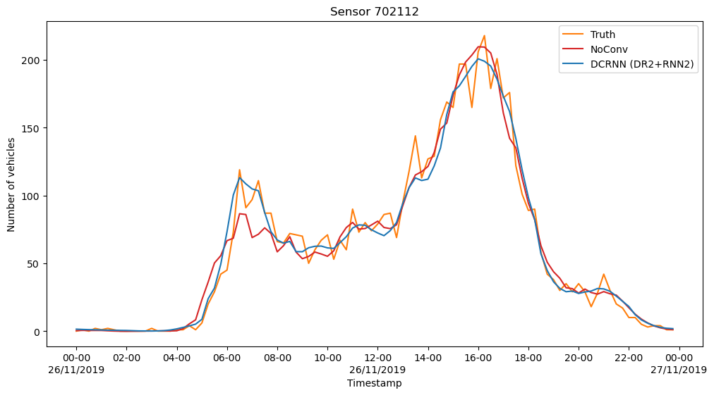

# Urban Diffusion Convolutional Recurrent Neural Network: Data-Driven Traffic Forecasting in Urban Environment

This is a spin-off of the PyTorch implementation of Diffusion Convolutional Recurrent Neural Network in the paper:
- Yaguang Li, Rose Yu, Cyrus Shahabi, Yan Liu, [Diffusion Convolutional Recurrent Neural Network: Data-Driven Traffic Forecasting](https://arxiv.org/abs/1707.01926), ICLR 2018. 

The original PyTorch implementation that this repository is build upon is available at: [DCRNN_PyTorch](https://github.com/chnsh/DCRNN_PyTorch)

# UrbanDCRNN#1: The Hague

In this implementation, instead of the originally used traffic speed data, the vehicle counts from 123 road sensors are used for road traffic forecasting.
These sensors are located on lanes entering 13 different large street intersection on 2 different multilane roads in the centre of the Hague, the Netherlands. 

The time-series data contains vehicle counts aggregated into 15 minutes windows, collected in November 2019.

 MAPE (Stroke)")

## Results

The model in this repository has been pre-trained with the default DCRNN settings and
-  **9 hours of historical data** (`seq_len = 36`)
-  **2 hours prediction horizon** (`horizon = 8`)

using two hyperparameter choices:

1. NoConv - In this model the difussion convolution is disabled: `max_difussion_step = 0`
2. DCRNN (DR2+RNN2) - In this model two difussion steps are performed and 2 hidden RNN layers are used: `max_difussion_step = 2, num_rnn = 2`

**A detailed evaluation of these models can be found in the notebook `#8_Evaluate.ipynb`** 

A short summary of the results is collected in the table below with the standard deviation in brackets:

| Horizon  | MAE NoConv | MAE DCRNN | RMSE NoConv | RMSE DCRNN | mMAPE NoConv  | mMAPE DCRNN  |
| -------- | ---------- | --------- | ----------- | ---------- | ------------ | ----------- |
| 15min    | 5.3 (±2.3) | 4.9 (±2.1) | 7.6 (±3.2)  | 7.0 (±2.9) | 29.2% (±8.7%) | 27.5% (±8.7%) |
| 30min    | 5.6 (±2.5) | 5.0 (±2.2) | 8.1 (±3.4)  | 7.1 (±3.0) | 29.7% (±8.8%) | 26.6% (±8.2%) |
| 45min    | 5.9 (±2.6) | 5.0 (±2.2) | 8.6 (±3.6)  | 7.2 (±3.0) | 30.6% (±9.0%) | 26.8% (±8.2%) |
| 1h       | 6.3 (±2.9) | 5.2 (±2.4) | 9.3 (±4.2)  | 7.5 (±3.4) | 31.6% (±9.3%) | 26.8% (±8.4%) |
| 1h15min  | 6.6 (±3.0) | 5.2 (±2.3) | 9.7 (±4.2)  | 7.4 (±3.2) | 32.4% (±9.6%) | 26.9% (±8.4%) |
| 1h30min  | 6.9 (±3.2) | 5.2 (±2.4) | 10.2 (±4.5) | 7.5 (±3.3) | 33.4% (±10.1%) | 27.0% (±8.4%) |
| 1h45min  | 7.2 (±3.4) | 5.3 (±2.4) | 10.6 (±4.8) | 7.5 (±3.3) | 34.0% (±10.4%) | 27.1% (±8.6%) |
| 2h       | 7.4 (±3.5) | 5.3 (±2.4) | 11.0 (±5.2) | 7.6 (±3.3) | 34.7% (±10.7%) | 27.6% (±9.0%) |
 
## Graph preparation

Preparation of the graph capturing the spatial dependencies between the sensors is detailed across several notebooks in this repository. 

In short, the traffic rules are encoded into the cost table to block difussion on illegal routes:
1. Chosen roads form a loop that is embedded in the network of lower rank streets.
2. Sensors are divided into three categories:
    - Passthrough lanes along the loop
    - Sources into the loop
    - Exits from the loop
3. There are two directions of traffic flow along the loop; clockwise and counterclockwise, and the traffic from the opposite directions is blocked.
4. Sources have only out-traffic, Exits have only in-traffic
5. There is strictly no difussion between sensors from the same crossing

Application of these rules sparsifies the otherwise shortest asymmetric route matrix between all sensors, preparing the input for the normalized adjacency matrix:

# Steps for reproduction

In order to reproduce this experiment, follow the procedure by visiting the Jupyter notebooks in this repository:

1. #1_StoreTimeSeriesDataH5.ipynb
2. #2_Prepare_Graph.ipynb.ipynb
3. #3_Compute_distances.ipynb
4. #4_Compute_costs.ipynb
5. #5_Generate_Training_Data.ipynb
6. #6_Analyze_adj_mx.ipynb

   At this point, running: `python experiment.py ---config_filename="fill the chosen yaml from data/model/"` in the terminal starts the training of the model. Remember to set `epoch = 0` to start the training for scratch. This procedure will overwrite the models in `./models/` 
   
   After the training is complete, set `epoch` in the corresponding yaml to the number of the epoch that you want to use for generating predictions, and move to the next step.

   Tensorboard logs are available for the model training overview. 

7. #7_Generate_Predictions.ipynb
8. #8_Evaluate.ipynb

The snapshot of the requirements for the complete environment used for this project can be found in `requirements.txt` (Python 3.10.9)

## Changelog

A short summary of the modifications with respect to the original implementation:

1. Added scripts for generation and visualisation of a new data set using Vehicle Count from road sensors in the Hague, the Netherlands.
2. Added a script for encoding the spatial dependencies between the road sensors into a cost/adjacency matrix
3. Added scripts for analysis of the adjacency matrix used by the Difussion Convolution
4. Prediction (test set) evaluation function in the DCRNNSupervisor script optionally computes MAE, RMSE and MAPE with their corresponding standard deviations
5. Added a few training workflow automation scripts (Contributors: [sqbly](https://github.com/sqbly) and [felixk29](https://github.com/felixk29))
6. Added a script for detailed evaluation and visualisation of the predictions.

